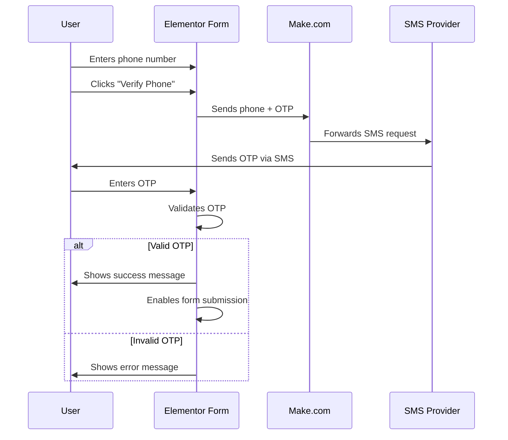

# Elementor OTP Verification Solution

 *Example of the OTP verification flow in action*

## Overview
A robust JavaScript solution for adding phone number verification via OTP (One-Time Password) to Elementor forms. This implementation seamlessly integrates with Make.com to send SMS messages and prevents form submission until phone verification is complete.

## Features
- 📱 Phone number verification with 6-digit OTP
- 🔒 Prevents form submission until verification
- 🔁 Resend OTP capability
- 📤 Make.com webhook integration
- 📱 Mobile-responsive design
- 🛡️ Client-side validation
- 🔔 User-friendly status messages
- 🔄 Automatic reset on phone number change

## File Structure
```
elementor-otp-verification/
├── elementor-otp-verification.js   # Main implementation script
├── make-automation.json             # Make.com scenario template
├── demo.html                        # Interactive demo (optional)
├── README.md                        # This documentation
└── assets/
    └── demo-screenshot.png          # Screenshot of the solution
```

## Installation

### 1. Add JavaScript to Elementor
1. Go to your WordPress Dashboard
2. Navigate to Elementor → Custom Code
3. Click "Add New"
4. Name it "OTP Verification"
5. Paste the contents of `elementor-otp-verification.js` in the "Code" box
6. Select "Location" → "Body - End"
7. Set "Load Method" to "Default"
8. Enable "Active" and save

### 2. Configure Make.com
1. Import the `make-automation.json` scenario into Make.com
2. Configure the SMS module with your SMS provider (Twilio, Vonage, etc.)
3. Update the webhook URL in the JavaScript to match your Make.com webhook:
```javascript
// In elementor-otp-verification.js
const response = await fetch('YOUR_MAKE_COM_WEBHOOK_URL', {
  // ...
});
```

### 3. Customize for Your Form
Update the form field selectors in the JavaScript if needed (most Elementor forms will work without modification).

## How It Works



## Configuration Options

### Customize Messages
Edit these in the JavaScript file:
```javascript
// Success messages
showMessage('OTP sent successfully!', 'green');
showMessage('Phone verified successfully!', 'green');

// Error messages
showMessage('Please enter a phone number', 'red');
showMessage('Invalid OTP. Please try again.', 'red');
```

### Adjust OTP Length
Change the OTP generation logic:
```javascript
// 6-digit OTP (default)
generatedOtp = Math.floor(100000 + Math.random() * 900000);

// For 4-digit OTP:
generatedOtp = Math.floor(1000 + Math.random() * 9000);
```

## Make.com Automation Setup

1. Import the `make-automation.json` file into Make.com
2. Configure the SMS module with your credentials
3. The scenario handles:
   - Receiving phone number and OTP from your website
   - Sending SMS via your provider
   - Error handling and logging
4. Test with the "Run once" feature in Make.com

## Troubleshooting

### OTP Not Sending
- Verify Make.com webhook URL is correct
- Check SMS provider credentials in Make.com scenario
- Ensure phone number format is correct (include country code)

### Verification Not Working
- Check browser console for JavaScript errors
- Ensure no ad blockers are interfering
- Verify all required form fields are filled

### Styling Issues
- Add custom CSS to match your theme:
```css
/* Example customizations */
#verify-phone-btn {
  background-color: #4CAF50;
  color: white;
}

#otp-container {
  border: 1px solid #ddd;
  padding: 15px;
  margin-top: 10px;
}
```

## Browser Support
- Chrome (latest)
- Firefox (latest)
- Safari (latest)
- Edge (latest)
- Mobile Safari (iOS 12+)
- Chrome for Android (Android 8+)

## Contributing
Contributions are welcome! Please follow these steps:
1. Fork the repository
2. Create a new branch (`git checkout -b feature/improvement-name`)
3. Commit your changes (`git commit -am 'Add some feature'`)
4. Push to the branch (`git push origin feature/improvement-name`)
5. Create a new Pull Request

## License
This project is licensed under the MIT License - see the [LICENSE](LICENSE) file for details.

---

**Note:** This solution requires a working SMS provider integration through Make.com. Test messages may incur costs depending on your SMS provider.
